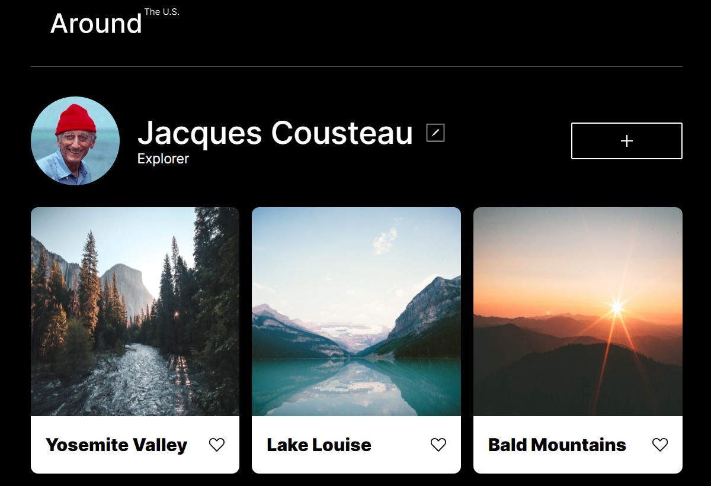

Project name: Around the U.S.

This project is composed of several images from around the U.S. The visual concept is for any individual to be able to add their own images to the website from around the U.S.

This project uses figma for the design brief and specifications, while also utilizing grid layout, flexbox, and media queries for responsive design.

https://rmaldon3811.github.io/se_project_aroundtheus/

